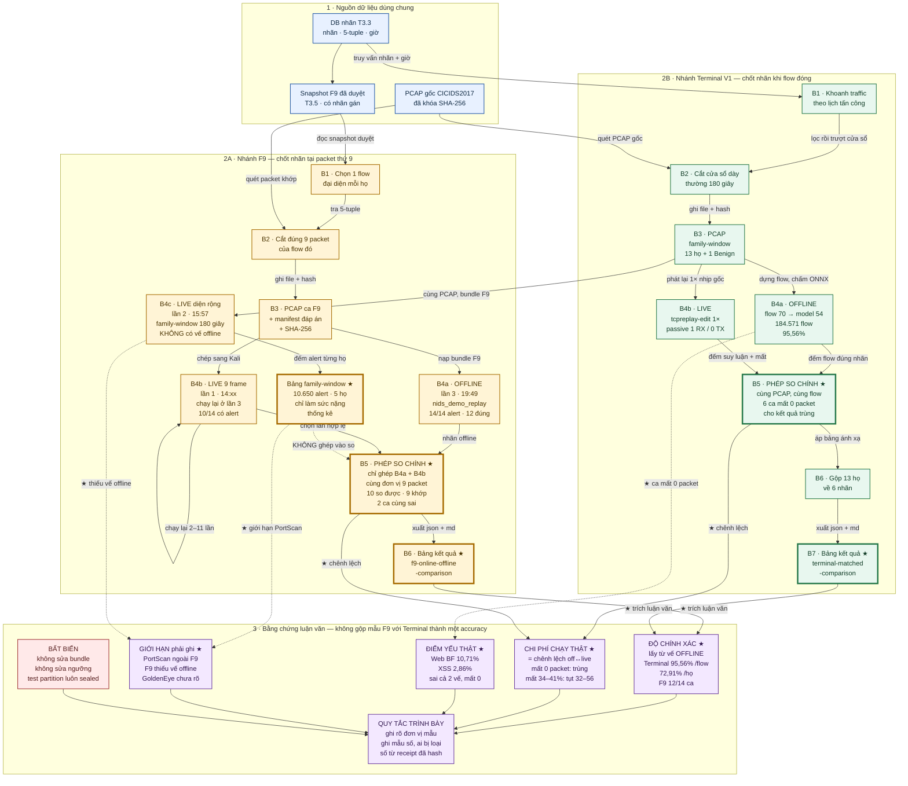

# Luồng PCAP → replay → evidence của F9 và Terminal V1




## Đọc sơ đồ trong 30 giây

1. Cả hai nhánh xuất phát từ **cùng một PCAP gốc** và **cùng một cơ sở dữ liệu nhãn**. Khác nhau ở chỗ cắt bao nhiêu traffic và chốt nhãn lúc nào.
2. **F9** cắt đúng chín packet đầu của một flow rồi chốt nhãn ngay tại packet thứ 9. Một ca = một flow.
3. **Terminal V1** cắt một cửa sổ thời gian dày traffic (thường 180 giây), dựng lại toàn bộ flow trong đó, chốt nhãn khi flow đóng. Một ca = hàng nghìn flow.
4. Mỗi nhánh chạy **cùng một PCAP theo nhiều cách** để tách lỗi model khỏi lỗi hạ tầng: offline đọc thẳng file, live phát lại qua mạng lab vào cảm biến DPDK. Riêng F9 có ba lần chạy, đánh số theo đúng thứ tự lịch sử trong sơ đồ.
5. **Dấu ★ đánh dấu thứ phải đưa vào luận văn.** Khối tím cuối liệt kê bốn nhóm nội dung cần trích và quy tắc trình bày.

## Đưa gì vào bằng chứng luận văn

Bốn ô tím trong sơ đồ tương ứng bốn nhóm nội dung. Mỗi nhóm ghi rõ lấy số ở đâu.

### Nhóm 1 — Độ chính xác của model

Lấy từ **vế offline**, vì vế live đã dính nhiễu hạ tầng.

| Nội dung | Con số | File nguồn |
|---|---|---|
| Terminal V1 theo flow | 176.383/184.571 = **95,56%** | `matched-terminal-20260809/terminal-matched-comparison.json` |
| Terminal V1 trung bình đều theo họ | **72,91%** | cùng file, tính từ `rows[].offline.correct_rate` |
| F9 offline | **12/14 ca** — ghi kèm câu "mẫu số 14, không dùng như một tỷ lệ chính xác" | `replay-runs/20260808-194942/f9-online-offline-comparison.json` |

### Nhóm 2 — Chi phí của việc chạy thật

Đây là kết quả có giá trị nhất theo spec, lấy từ **chênh lệch giữa hai vế**.

| Nội dung | Con số | File nguồn |
|---|---|---|
| Sáu ca Terminal mất 0 packet cho kết quả trùng khít offline | SSH 87,57% · SQL 76,92% · Web BF 10,71% · XSS 2,86% | `terminal-matched-comparison.json`, trường `port_imissed` |
| Mức sụt tỷ lệ thuận với packet mất | mất 4,33% tụt 5,60 điểm; mất 34,27% tụt 56,03 điểm | cùng file |
| F9 hai vế cho cùng đáp án | 9/10 ca, trong đó **2 ca cùng sai giống nhau** | `f9-online-offline-comparison.json`, mục `head_to_head` |

### Nhóm 3 — Điểm yếu thật của model

Phân biệt với lỗi hạ tầng bằng tiêu chí: **sai giống nhau ở cả hai vế và mất 0 packet**.

| Nội dung | Con số | Nguyên nhân ghi được |
|---|---|---|
| Web Brute Force | 10,71% cả offline lẫn live | nhãn `Other` chỉ có 576 dòng train so với 1.296.000 dòng Benign |
| Web XSS | 2,86% cả offline lẫn live | như trên; raw argmax đã sai sẵn nên ngưỡng không phải nguyên nhân duy nhất |
| DoS Slowhttptest ở F9 | sai ở cả hai vế | nhầm sang `DoS GoldenEye`, cùng nhóm biến thể HTTP flood |

### Nhóm 4 — Giới hạn phải ghi kèm mọi bảng

| Giới hạn | Cách viết đúng |
|---|---|
| PortScan trên F9 | *không áp dụng* vì flow ngắn hơn ngưỡng chín packet, **đừng ghi 0%** |
| F9 diện rộng | thiếu vế offline nên **không tách được lỗi model khỏi lỗi hạ tầng** |
| DoS GoldenEye 6,74% | giả thuyết hỏng đặc trưng inter-arrival-time, spec ghi rõ **chưa kiểm chứng** |
| Bot và Infiltration ở Terminal | 0 suy luận là **lệch phạm vi IP**, không phải model bỏ sót |
| Sáu ca live Terminal | có `summary.json.tmp` đầy đủ nhưng **không có receipt chính thức**, không được tự promote |
| Heartbleed | không thuộc tập nhãn của bundle, **không tính vào accuracy** |
| Mọi kết quả live | chỉ có giá trị trong phạm vi phòng lab VMware |

### Quy tắc trình bày

1. Không gộp mẫu F9 với Terminal thành một accuracy.
2. Mỗi bảng ghi rõ **đơn vị mẫu, mẫu số, ca nào bị loại và vì sao**.
3. Số lấy từ receipt hoặc `summary.json` đã có SHA-256, không lấy từ dashboard.
4. Không sửa PCAP gốc, bundle, schema hay ngưỡng; test partition giữ nguyên trạng thái niêm phong; mọi lần chạy hỏng đều giữ lại.

## Chú giải mũi tên

Nhãn trên mũi tên trong sơ đồ được rút ngắn cho dễ đọc. Bảng dưới ghi đầy đủ việc thực sự làm ở mỗi bước chuyển.

### Nhánh F9

| Mũi tên | Nhãn trong sơ đồ | Việc thực sự làm |
|---|---|---|
| Snapshot F9 → B1 | đọc snapshot đã duyệt | Đọc danh sách snapshot F9 đã qua kiểm tra, ưu tiên `mutual_unique`, rồi `class_consensus`, rồi `flow_id` nhỏ nhất |
| B1 → B2 | tra 5-tuple | Tra cơ sở dữ liệu nhãn để lấy 5-tuple chuẩn và khoảng thời gian từ lúc flow bắt đầu tới mốc checkpoint F9 |
| PCAP gốc → B2 | quét packet khớp 5-tuple | Quét tuần tự file PCAP gốc (hàng chục GB, hơn 11 triệu packet) và giữ lại packet khớp cả 5-tuple lẫn khoảng thời gian |
| B2 → B3 | ghi file + hash | Ghi ra PCAP 9 record, tính SHA-256, chốt đáp án và thông tin nguồn vào manifest |
| B3 → B4a | nạp bundle F9 | Nạp bundle F9 đã khóa và cho `nids_demo_replay` đọc thẳng file, không qua mạng |
| B3 → B4b | chép sang Kali | Chép PCAP sang máy Kali, chỉ ghi đè địa chỉ MAC, giữ nguyên IP, cổng và nhịp thời gian gốc |
| B4b → B4b (vòng lặp) | hỏng thì chạy lại 2–11 lần | Chạy lại khi mất capture, khi bắt nhầm flow lạ, hoặc khi jumbo frame bị chặn. Mọi lần chạy đều được giữ |
| B4a → B5 | nhãn offline | Lấy nhãn suy luận cùng độ tin cậy từ kết quả offline |
| B4b → B5 | chọn 1 lần chạy hợp lệ | Chọn một lần chạy hợp lệ, đối chiếu 5-tuple của alert với manifest, loại alert thuộc flow khác |
| B5 → B6 | xuất json + md | Dựng bảng đối chiếu, ghi cả bản JSON để trích số lẫn bản Markdown để đọc |
| B3 nhánh Terminal → B4c | cùng PCAP, chấm bằng bundle F9 | Dùng lại chính PCAP family-window của nhánh Terminal, phát lại qua mạng lab nhưng chấm bằng bundle F9 |
| B4c → bảng family-window | đếm alert từng họ | Gom luồng alert thô theo từng họ, đếm tổng và đếm số đúng |
| Bảng family-window → B5 (nét đứt) | KHÔNG ghép vào phép so | Nhắc rõ bản diện rộng khác đơn vị mẫu nên không được đưa vào phép so offline ↔ live |

### Nhánh Terminal V1

| Mũi tên | Nhãn trong sơ đồ | Việc thực sự làm |
|---|---|---|
| DB nhãn → B1 | truy vấn nhãn + thời gian | Lấy danh sách key mang nhãn của họ đó cùng khoảng thời gian tấn công theo lịch dataset |
| PCAP gốc → B2 | quét toàn bộ PCAP gốc | Quét toàn bộ capture thô để tìm packet thuộc các key đã khoanh |
| B1 → B2 | lọc rồi trượt cửa sổ | Lọc packet theo key và thời gian, trượt cửa sổ để tìm đoạn dày traffic nhất, thường 180 giây |
| B2 → B3 | ghi file + hash | Ghi PCAP family-window và tính SHA-256 |
| B3 → B4a | dựng flow rồi chấm ONNX | Dựng flow hai chiều theo schema 70 feature, lấy 54 feature của profile A, chạy ONNX rồi áp ngưỡng khóa |
| B3 → B4b | phát lại đúng 1× nhịp gốc | Chép sang Kali, chạy `tcpreplay-edit` tốc độ 1×, chỉ ghi đè MAC |
| B4a → B5 | đếm flow đúng nhãn | Đếm số flow được gán đúng nhãn mong đợi trên tổng số flow dựng được |
| B4b → B5 | đếm suy luận + packet mất | Đếm số suy luận mang nhãn mong đợi, kèm `ipackets`, `imissed`, trạng thái tắt máy và phạm vi IP |
| B5 → B6 | áp bảng ánh xạ nhãn | Gộp 13 họ gốc về 6 nhãn đầu ra của model |
| B6 → B7 | xuất json + md | Ghi bảng so sánh ra JSON và Markdown, kèm danh sách file đã hash |

## Ba phép đo của nhánh F9

Nhánh F9 không chỉ chạy offline một lần và live một lần. Có ba phép đo, ba đơn vị mẫu khác nhau, phải báo cáo tách rời.

| Phép đo | Đầu vào | Đơn vị mẫu | Kết quả |
|---|---|---|---|
| B4a offline | PCAP 9 packet | 1 ca = 1 flow | 14/14 ca có alert, **12/14 đúng** |
| B4b live 9 frame | cùng PCAP 9 packet, phát qua mạng lab | 1 ca = 1 flow | **10/14 ca bắt được alert**; trong 10 ca so được thì **9 ca offline và live cho cùng đáp án** |
| B4c live diện rộng | PCAP family-window 180 giây | 1 mẫu = 1 flow chạm F9 | 10.650 alert trên 5 họ; accuracy dao động rất mạnh (FTP-Patator 100% · SSH-Patator 100% · DDoS 83,8% · DoS Hulk 77,6% · DoS GoldenEye 6,7%); PortScan 0 alert |

**Chỉ B4a và B4b ghép được thành một phép so** — hai bên cùng đơn vị mẫu là 1 flow / 9 packet / 1 checkpoint. B4c cho cỡ mẫu lớn hơn hẳn nhưng **không được cộng vào**: nó đếm mọi flow chạm checkpoint trong cửa sổ 180 giây, khác đơn vị.

### Ba phép đo ra đời theo thứ tự nào, và vì sao

Sơ đồ xếp B4a → B4b → B4c theo logic. Lịch thật thì ngược lại, và biết đúng thứ tự mới hiểu vì sao có phép đo thứ ba.

| Thời điểm | Việc | Mã lần chạy | Có mấy vế |
|---|---|---|---|
| Trước 14:00 | T8.5 gốc: **1 flow, 1 checkpoint, 1 alert, đúng 1 họ là DDoS** | — | chỉ live |
| 14:xx | Phát live 9 frame cho **đủ 14 họ**, đúng 13/14 | `rebuild-20260808` | **chỉ live** |
| 15:xx | Phản hồi: 9 packet mỗi họ chỉ là 1 flow, không đủ bằng chứng thống kê | — | — |
| 15:57 | Phát diện rộng family-window, 10.650 alert | `20260808-155731` | **chỉ live** |
| 19:49 | **Chạy lại live 9 frame cho đủ 14 ca, và bổ sung vế offline** | `20260808-194942` | **cả hai vế** |

**Hai phép đo đầu đều chỉ có vế live.** Chạy xong rồi mới lộ ra vấn đề: không có gì để đối chiếu. Khi family-window cho DoS GoldenEye 6,74%, không ai nói được đó là model kém hay đường truyền kém, vì không có con số offline tương ứng.

**Đó là lý do có lần chạy thứ ba `20260808-194942`.** Nó không phải chạy thêm cho nhiều dữ liệu. Nó được dựng riêng để **so offline với live cho đúng**, và gồm hai việc:

1. **Chạy lại toàn bộ live 9 frame** cho đủ 14 ca. Đây chính là chiến dịch chạy lại 2–11 lần mỗi ca đã nói ở mục trên — phải cố cho bằng được mỗi ca một mẫu live hợp lệ, nếu không mẫu số của phép so sẽ khuyết.
2. **Thêm vế offline** bằng `run_t85_offline_f9.py`, chạy đúng những PCAP đó nhưng đọc thẳng file, không qua mạng.

**Điều kiện then chốt, ghi trong checklist của spec:**

> Online và offline **cùng đơn vị mẫu**: 1 flow / 9 gói / 1 checkpoint.

Đây là lý do phép so phải dùng bản 9 frame chứ không dùng bản diện rộng. Family-window đếm mọi flow chạm checkpoint trong cửa sổ 180 giây — khác đơn vị mẫu, không ghép được. Muốn so offline với live cho đúng thì bắt buộc phải có bản 9 frame ở cả hai vế.

**Mục tiêu spec tách bạch làm hai câu hỏi, mỗi câu một vế:**

| Câu hỏi | Trả lời bằng |
|---|---|
| Model F9 phân loại đúng họ không? | vế **offline** — chạy thẳng trên file, không qua mạng |
| Đưa qua card mạng thật thì kết quả có đổi không? | vế **live** — Kali bắn qua dây, Ubuntu DPDK bắt |

Và câu quan trọng nhất trong spec:

> Chênh lệch giữa hai vế **chính là chi phí của việc chạy thật**. Đó là kết quả có giá trị nhất của phần này, không phải con số accuracy đơn lẻ.

**Vai trò còn lại của phép đo diện rộng:** nó không tham gia phép so off ↔ live, nhưng giữ nguyên giá trị làm khối lượng mẫu. Mười bốn ca, mỗi ca một flow, sai một ca là tỷ lệ nhảy 7 điểm phần trăm. 10.650 mẫu mới nói được model mạnh yếu ở đâu theo từng họ. Hai phép đo bổ trợ nhau: bản 9 frame cho **tính so sánh được**, bản diện rộng cho **sức nặng thống kê**.

### Ba cách so sai đã bị loại bỏ

Nêu ra vì đây là phần dễ làm hỏng kết quả nhất, cả ba đều ghi trong spec:

1. **Tra nhãn bằng 5-tuple.** Khóa 5-tuple không phân biệt hướng nên va chạm ở **48%** số flow; một 5-tuple ánh xạ tới nhiều nhãn khác nhau.
2. **Nối live với offline bằng 5-tuple.** Quá trình tái dựng PCAP **đánh số lại cổng nguồn**: 0 trên 5.343 cổng quan sát ở cảm biến xuất hiện trong bảng nhãn gốc. Chỉ `flow_id` trong manifest là khóa nối tin cậy.
3. **Gõ tay nhãn vào bảng cứng.** Nhãn gốc dùng dấu gạch dài, gõ tay là lệch.

### Bốn quy tắc báo số

1. Tử số và mẫu số phải cùng tập ca. **Không bao giờ đặt `5/14` cạnh `12/12`.**
2. Ca không bắt được packet nào thì **loại khỏi mẫu**, đếm riêng thành "capture miss".
3. Ca đủ packet nhưng flow không đạt checkpoint (PortScan) thì **giữ trong mẫu**, ghi rõ lý do.
4. Mọi con số phải kèm đường dẫn file sinh ra nó.

### Hai hạn chế của phép đo diện rộng

**1. Không có vế offline tương ứng.** Phía offline chỉ có `nids_demo_replay` chạy từng PCAP 9 packet, ra đúng một checkpoint mỗi ca. Không tồn tại bộ chấm offline duyệt cả family-window cho checkpoint F9, khác với nhánh Terminal đã có `score_terminal_flows_onnx.py`. Vì vậy **riêng con số 10.650 flow không tách được lỗi model khỏi lỗi hạ tầng** — đúng thứ mà spec nói là có giá trị nhất lại thiếu ở chính phép đo lớn nhất. Đây là khoảng trống phải ghi rõ trong luận văn.

**2. Câu hỏi mở lớn nhất chưa có lời giải.** Spec ghi `DoS GoldenEye: 6,7% online nhưng 100% offline`, với 3.175 trên 4.127 alert bị gán thành `DoS Hulk`. Giả thuyết: `tcpreplay` không giữ chính xác khoảng cách thời gian giữa các packet, làm hỏng nhóm đặc trưng inter-arrival-time — nhóm chính để phân biệt các biến thể HTTP flood. Spec ghi rõ **"Chưa kiểm chứng"**, kèm cách kiểm chứng đề xuất là đối chiếu delta timestamp trong PCAP gốc với delta quan sát ở cảm biến, cho cùng một flow.

Hai câu hỏi mở khác trong spec: `dos-slowhttptest` không sinh alert ở **cả hai vế** vì 9 packet cách nhau khoảng 20 giây, nghi flow hết hạn trước khi đạt checkpoint; và Heartbleed có `flow_id` rỗng, không thuộc họ nào của model, chạy chỉ để đủ 14 ca và **không được tính vào accuracy**.

### B4c dùng chung PCAP với nhánh Terminal

B4c **không** cắt PCAP mới. Nó phát lại đúng những file trong `run_log/full-flow-v1/family-windows/` mà nhánh Terminal đang dùng, chỉ khác ở chỗ chấm bằng bundle F9 thay vì bundle Terminal. Trong sơ đồ, đây là mũi tên đi từ bước B3 của nhánh Terminal sang B4c của nhánh F9.

Việc dùng chung là **có chủ đích ngay từ khi cắt**, không phải trùng hợp. Bảng ánh xạ dự kiến được chốt trước khi chạy:

| Nhãn thật | F9 dự kiến trả về | Terminal dự kiến trả về |
|---|---|---|
| FTP-Patator | FTP-Patator | FTP-Bruteforce |
| SSH-Patator | SSH-Patator | SSH-Bruteforce |
| DoS Hulk | DoS Hulk | DoS |
| DoS GoldenEye | DoS GoldenEye | DoS |
| DDoS | DDoS | DoS |
| PortScan | PortScan | PortScan |

Bảng này cho thấy rõ hai model **không cùng một bài toán**: F9 phải phân biệt được ba loại DoS khác nhau, còn Terminal chỉ cần gọi chung là `DoS`. Nhầm Hulk thành GoldenEye bị F9 tính là sai, Terminal thì tính là đúng. Vì vậy vẫn không được cộng hai kết quả lại, kể cả khi chúng chạy trên cùng một file.

## Live 9 frame phải chạy lại nhiều lần

Đây là chi tiết dễ bị bỏ sót khi viết luận văn. Phát 9 frame qua mạng ảo rất mong manh, nên mỗi ca phải chạy lại nhiều lần cho tới khi có một lần chạy hợp lệ:

| Ca | Số lần chạy | Lần được chọn | Kết cục |
|---|---|---|---|
| FTP-Patator | 11 | `ftp-patator-r12t3` | có alert |
| DDoS | 8 | `ddos-r8t3` | bắt nhầm flow lạ, bị loại |
| SSH-Patator | 8 | `ssh-patator-r12t3` | có alert |
| Infiltration | 6 | `infiltration-r12t3` | có alert |
| DoS GoldenEye | 5 | `dos-goldeneye-r5` | không có alert |
| Web Brute Force | 4 | `web-brute-force-r12` | có alert |
| Bot / DoS Slowhttptest / DoS slowloris / Heartbleed / SQL Injection | 3 mỗi ca | — | có alert |
| DoS Hulk / PortScan / XSS | 2 mỗi ca | — | Hulk và PortScan bị capture hụt |

Ba lý do phải chạy lại: **mất capture** (cảm biến chưa kịp sẵn sàng thì frame đã bay qua), **bắt nhầm flow lạ** (alert thuộc 5-tuple khác manifest, như ca DDoS), và **jumbo frame bị chặn** trên đường truyền ảo.

Cả ba lý do đều thuộc về phòng lab, không phải model. Mọi lần chạy hỏng đều được giữ lại làm bằng chứng, không xóa.

## Offline so với live — nhánh Terminal V1

Đây là phép so quan trọng nhất để kết luận độ chính xác. Cùng một file PCAP, cùng một model, chỉ khác đường đi: một bên đọc thẳng file, một bên phát qua mạng lab.

| Ca | Offline | Live | Chênh lệch | Packet mất khi live |
|---|---|---|---|---|
| Benign (đối chứng) | 100,00% | 100,00% | 0,00 | 0,00% |
| SSH-Patator | 87,57% | 87,57% | **0,00** | **0,00%** |
| Web SQL Injection | 76,92% | 76,92% | **0,00** | **0,00%** |
| Web Brute Force | 10,71% | 10,71% | **0,00** | **0,00%** |
| Web XSS | 2,86% | 2,86% | **0,00** | **0,00%** |
| FTP-Patator | 75,40% | 75,17% | −0,23 | **0,00%** |
| DoS slowloris | 98,75% | 93,15% | −5,60 | 4,33% |
| DoS Slowhttptest | 98,67% | 82,97% | −15,70 | 19,76% |
| DDoS | 68,03% | 53,99% | −14,04 | 2,97% |
| DoS Hulk | 98,75% | 59,78% | −38,97 | 40,67% |
| DoS GoldenEye | 98,90% | 66,90% | −32,00 | 35,01% |
| PortScan | 97,85% | 41,82% | **−56,03** | **34,27%** |
| Bot | 100,00% | không có suy luận | — | lệch phạm vi IP |
| Infiltration | 33,33% | không có suy luận | — | lệch phạm vi IP |

### Kết luận rút ra từ bảng trên

**1. Không mất packet thì live bằng đúng offline.** Sáu ca có `imissed = 0` cho kết quả trùng khít tới từng chữ số: SSH-Patator 87,57% cả hai bên, SQL Injection 76,92% cả hai bên, Web Brute Force 10,71% cả hai bên, XSS 2,86% cả hai bên. FTP-Patator lệch 0,23 điểm do một flow bị cắt ở cuối file.

Đây là bằng chứng mạnh nhất trong cả bộ dữ liệu: **model hành xử y hệt nhau ở hai môi trường.** Việc triển khai lên DPDK không làm hỏng model.

**2. Mất bao nhiêu packet thì tụt bấy nhiêu.** Nhìn hai cột cuối, chúng đi cùng chiều: mất 0% thì tụt 0 điểm; mất 4,33% tụt 5,60 điểm; mất 19,76% tụt 15,70 điểm; mất 35–41% tụt 32–39 điểm. Ca DDoS lệch khỏi quy luật (mất 2,97% nhưng tụt 14,04 điểm) vì máy gửi trượt 3.362 packet và 4,6% packet nằm ngoài phạm vi IP.

**3. Vì vậy con số live không phải độ chính xác của model.** Nó là độ chính xác của model **nhân với** chất lượng đường truyền phòng lab. Muốn nói về model thì lấy cột offline.

**4. Web Brute Force và XSS sai ở cả hai môi trường.** 10,71% và 2,86% giống hệt nhau offline lẫn live, mất 0% packet. Không đổ được cho hạ tầng. **Đây là điểm yếu thật của model**, do gộp Bot, Infiltration và Web Attack chung vào nhãn `Other` mà tập huấn luyện chỉ có 576 dòng `Other` so với 1.296.000 dòng Benign.

### Kết luận về độ chính xác Terminal V1

Lấy cột offline, vì cột live đã dính nhiễu hạ tầng:

| Cách tính | Kết quả | Khi nào dùng |
|---|---|---|
| Theo flow, 13 họ tấn công | **176.383/184.571 = 95,56%** | khi muốn nói về khối lượng traffic thực tế |
| Trung bình đều theo họ | **72,91%** | khi muốn nói về mức độ phủ các loại tấn công |

Hai con số lệch nhau vì PortScan một mình chiếm 84.222 trên 184.571 flow, tức 46% toàn bộ mẫu, mà lại là họ model làm tốt (97,85%). Tính theo flow thì họ này kéo trung bình lên. **Luận văn nên báo cả hai**, kèm câu giải thích.

Chi tiết đủ 13 họ:

| Họ | Nhãn mong đợi | Flow | Đúng | Tỷ lệ |
|---|---|---|---|---|
| PortScan | PortScan | 84.222 | 82.414 | 97,85% |
| DoS Hulk | DoS | 51.638 | 50.991 | 98,75% |
| DoS GoldenEye | DoS | 28.012 | 27.705 | 98,90% |
| DDoS | DoS | 15.764 | 10.725 | 68,03% |
| DoS Slowhttptest | DoS | 2.036 | 2.009 | 98,67% |
| DoS slowloris | DoS | 2.008 | 1.983 | 98,75% |
| FTP-Patator | FTP-Bruteforce | 435 | 328 | 75,40% |
| SSH-Patator | SSH-Bruteforce | 169 | 148 | 87,57% |
| Web Brute Force | Other | 112 | 12 | 10,71% |
| Web XSS | Other | 105 | 3 | 2,86% |
| Bot | Other | 54 | 54 | 100,00% |
| Web SQL Injection | Other | 13 | 10 | 76,92% |
| Infiltration | Other | 3 | 1 | 33,33% |
| **Tổng** | | **184.571** | **176.383** | **95,56%** |

Ca Benign đạt 358/358 nhưng nằm ngoài bảng vì không khớp phạm vi IP.

## Offline so với live — nhánh F9

Nhánh F9 so được ở quy mô nhỏ, mỗi ca một flow chín packet.

| Ca | Offline đoán | Live đoán | Hai bên có khớp |
|---|---|---|---|
| Bot | Bot | Bot | khớp, cùng đúng |
| DoS Slowhttptest | DoS GoldenEye | DoS GoldenEye | khớp, **cùng sai giống nhau** |
| DoS slowloris | DoS slowloris | DoS slowloris | khớp, cùng đúng |
| FTP-Patator | FTP-Patator | FTP-Patator | khớp, cùng đúng |
| Heartbleed | Web Attack – Brute Force | Web Attack – Brute Force | khớp, **cùng sai giống nhau** |
| Infiltration | Infiltration | Infiltration | khớp, cùng đúng |
| SSH-Patator | SSH-Patator | SSH-Patator | khớp, cùng đúng |
| Web Brute Force | Web Attack – Brute Force | Web Attack – Brute Force | khớp, cùng đúng |
| Web XSS | Web Attack – XSS | Web Attack – XSS | khớp, cùng đúng |
| Web SQL Injection | Web Attack – Sql Injection | Web Attack – Brute Force | **lệch nhau** |
| DDoS | DDoS | — | live bắt nhầm flow lạ |
| DoS GoldenEye | DoS GoldenEye | — | live không ra alert |
| DoS Hulk | DoS Hulk | — | live capture hụt |
| PortScan | PortScan | — | live capture hụt |

**Mẫu số là 10, không phải 14.** Bốn ca cuối không có kết quả live nên không so được.

### Kết luận rút ra

**1. Chín trên mười ca hai môi trường cho cùng đáp án.** Cùng kết luận với nhánh Terminal: model không đổi hành vi khi chạy live.

**2. Nhưng "khớp" không có nghĩa là "đúng".** Trong 9 ca khớp có 2 ca **cùng sai giống hệt nhau**: DoS Slowhttptest bị đoán thành DoS GoldenEye ở cả hai bên, Heartbleed bị đoán thành Web Brute Force ở cả hai bên. Phải viết rõ điều này, đừng để người đọc hiểu 9/10 là 90% chính xác.

**3. Một ca lệch nhau: Web SQL Injection.** Offline đoán đúng SQL Injection, live đoán thành Web Brute Force. Cỡ mẫu quá nhỏ để kết luận nguyên nhân.

**4. Bốn ca hỏng đều là lỗi phòng lab.** Bắt nhầm flow lạ, không ra alert, capture hụt hai lần — không ca nào là lỗi model.

### Kết luận về độ chính xác F9

| Phép đo | Kết quả | Dùng được để nói gì |
|---|---|---|
| Offline, 14 ca | **12/14 đúng** | chỉ chứng minh đường đi kỹ thuật chạy được đầu-cuối; mẫu số 14 quá nhỏ để gọi là accuracy |
| Live 9 frame, 10 ca so được | **9/10 khớp offline**, trong đó 2 ca cùng sai | chứng minh live không làm hỏng model |
| Live diện rộng, 10.650 flow | **90,38%** sau khi quy nhãn về 6 lớp | con số lớn nhất hiện có, nhưng đã dính mất packet |

Hai ca sai khi chạy offline:

- **DoS Slowhttptest** → đoán `DoS GoldenEye`, tin cậy 0,893. Nhầm biến thể trong cùng nhóm từ chối dịch vụ.
- **Heartbleed** → đoán `Web Attack – Brute Force`, tin cậy chỉ 0,383. Heartbleed vốn không nằm trong tập nhãn của bundle F9 đã khóa, nên ca này chỉ mang tính minh họa.

Mười hai ca còn lại đúng với độ tin cậy từ 0,9967 trở lên.

**Khoảng trống phải ghi rõ:** F9 không có phép đo offline ở quy mô lớn, nên **không thể tách lỗi model khỏi lỗi hạ tầng cho con số 90,38%**. Đó là lý do PortScan hiện 0% và GoldenEye hiện 6,74% mà không kết luận được nguyên nhân.

### Câu nên viết trong luận văn

> Trên nhánh Terminal V1, sáu trong mười bốn ca không mất packet nào khi chạy live và cho kết quả trùng khít với chạy offline tới từng chữ số thập phân, chứng tỏ việc triển khai lên DPDK không làm thay đổi hành vi của model. Ở các ca còn lại, mức sụt giảm tỷ lệ thuận với tỷ lệ packet bị mất, cao nhất là PortScan mất 34,27% packet và tụt 56,03 điểm phần trăm. Do đó độ chính xác của model được lấy từ phép đo offline: 95,56% trên 184.571 flow nếu tính theo flow, hoặc 72,91% nếu tính trung bình đều theo 13 họ tấn công. Trên nhánh F9, chín trong mười ca so được cho cùng đáp án ở hai môi trường, trong đó hai ca cùng sai giống nhau; F9 chưa có phép đo offline ở quy mô lớn nên chưa tách được ảnh hưởng của hạ tầng.

## Thông số huấn luyện model — confusion matrix và các chỉ số chuẩn

Ba mục trên đo **hệ thống chạy thật**. Mục này đo **bản thân model**, lấy từ lần huấn luyện đã chốt bundle Terminal V1.

**Nguồn:** `run_log/full-flow-v1/model/manifest.json`, profile `A` (`legacy_terminal`, 54 đặc trưng), ngưỡng khóa `0,9984837643`. Sinh bởi `python/nids_mvp/full_flow_model.py`, hàm `confusion_metrics()`.

**Cảnh báo bắt buộc ghi kèm:** toàn bộ số dưới đây là **validation**, không phải test. Trường `test_partition.status` trong manifest là `sealed` và `metric_reads = 0` — tập test chưa được chấm lần nào. Về mặt phương pháp, đây là số dùng để **chọn model**, chưa phải số để **báo cáo năng lực model**.

### Cỡ mẫu

| Tập | Số dòng | Benign | DoS | PortScan | FTP-BF | SSH-BF | Other |
|---|---|---|---|---|---|---|---|
| Train | 1.602.243 | 1.296.000 | 223.314 | 77.709 | 3.042 | 1.602 | **576** |
| Validation | 262.232 | 182.159 | 44.284 | 34.680 | 684 | 310 | **115** |
| Test | — | — | — | — | — | — | — |

Nhãn `Other` chỉ có **576 dòng train** so với 1.296.000 dòng Benign — tỷ lệ 1:2250. Đây chính là nguyên nhân gốc của Web Brute Force 10,71% và XSS 2,86% đã nêu ở Nhóm 3.

### Confusion matrix — 6 lớp, tập validation

Hàng = nhãn thật, cột = nhãn model đoán. Đường chéo in đậm là số đoán đúng.

| Thật ↓ / Đoán → | Benign | FTP-BF | SSH-BF | PortScan | DoS | Other | Tổng hàng |
|---|---|---|---|---|---|---|---|
| **Benign** | **182.015** | 0 | 0 | 133 | 11 | 0 | 182.159 |
| **FTP-Bruteforce** | 3 | **681** | 0 | 0 | 0 | 0 | 684 |
| **SSH-Bruteforce** | 0 | 0 | **310** | 0 | 0 | 0 | 310 |
| **PortScan** | 19 | 0 | 0 | **34.661** | 0 | 0 | 34.680 |
| **DoS** | 283 | 0 | 0 | 0 | **44.001** | 0 | 44.284 |
| **Other** | 2 | 0 | 0 | 0 | 0 | **113** | 115 |
| **Tổng cột** | 182.322 | 681 | 310 | 34.794 | 44.012 | 113 | **262.232** |

Đọc ma trận này ra ba điều:

1. **Không có nhầm lẫn giữa các họ tấn công với nhau.** Mọi ô ngoài đường chéo ở phần tấn công đều bằng 0. Toàn bộ lỗi là tấn công bị bỏ sót thành `Benign` (304 dòng), hoặc `Benign` bị báo nhầm thành tấn công (144 dòng).
2. **Lỗi lớn nhất là 283 dòng DoS bị bỏ sót.** Đây là hệ quả trực tiếp của ngưỡng 0,9985 — ngưỡng được chọn để ép `benign_fpr` xuống dưới 1%, và cái giá phải trả nằm ở recall của DoS.
3. **144 dòng Benign báo nhầm** trên 182.159, tức `benign_fpr = 0,079%`, thấp hơn nhiều so với trần chính sách 1%.

### Chỉ số theo từng lớp

| Lớp | Support | Precision | Recall | F1 | TP | FP | FN |
|---|---|---|---|---|---|---|---|
| Benign | 182.159 | 0,9983 | 0,9992 | 0,9988 | 182.015 | 307 | 144 |
| FTP-Bruteforce | 684 | **1,0000** | 0,9956 | 0,9978 | 681 | 0 | 3 |
| SSH-Bruteforce | 310 | **1,0000** | **1,0000** | **1,0000** | 310 | 0 | 0 |
| PortScan | 34.680 | 0,9962 | 0,9995 | 0,9978 | 34.661 | 133 | 19 |
| DoS | 44.284 | 0,9998 | 0,9936 | 0,9967 | 44.001 | 11 | 283 |
| Other | 115 | **1,0000** | 0,9826 | 0,9912 | 113 | 0 | 2 |

### Chỉ số tổng hợp

| Chỉ số | Giá trị | Ghi chú |
|---|---|---|
| Accuracy | **0,99828** | 261.781/262.232 đoán đúng |
| Macro-F1 | **0,99705** | trung bình đều 6 lớp — chỉ số chính của chính sách chọn model |
| Weighted-F1 | 0,99828 | trùng accuracy vì Benign áp đảo |
| Macro-precision | 0,99904 | |
| Macro-recall | 0,99508 | |
| MCC | **0,99635** | hệ số tương quan Matthews, đa lớp |
| Attack precision (nhị phân) | 0,99820 | gộp 5 họ tấn công thành một lớp |
| Attack recall (nhị phân) | 0,99617 | |
| Benign FPR | **0,00079** | trần chính sách là 0,01 |
| Min target F1 | 0,99780 | thấp nhất trong `FTP-Bruteforce` và `PortScan` |

Với dữ liệu lệch 1:2250 như thế này, **macro-F1 và MCC mới là chỉ số đáng đọc**; accuracy 99,83% chủ yếu phản ánh việc đoán đúng Benign.

### Vì sao chọn profile A

Năm profile đặc trưng được huấn luyện rồi so trên cùng tập validation. Thứ tự ưu tiên khóa trong chính sách: `min_target_f1` giảm dần → `macro_f1` giảm dần → `attack_recall` giảm dần → `benign_fpr` tăng dần, và mọi ứng viên phải có `benign_fpr ≤ 0,01`.

| Profile | Tên | Số đặc trưng | Macro-F1 | Attack recall | Benign FPR | Min target F1 |
|---|---|---|---|---|---|---|
| **A** ★ | legacy_terminal | **54** | 0,99705 | 0,99617 | 0,00079 | 0,99780 |
| B | terminal_traffic | 61 | 0,99700 | 0,99578 | 0,00075 | 0,99780 |
| C | terminal_context | 64 | 0,99729 | 0,99493 | 0,00008 | 0,99989 |
| D | terminal_ports | 66 | 0,98430 | 0,93464 | 0,00027 | 0,99766 |
| E | terminal_full | 70 | 0,99326 | 0,97566 | 0,00069 | 0,99744 |

Ba profile A, B, C đều **đạt** (`rejection_reasons` rỗng). D bị loại vì `attack_recall_drop` và `macro_f1_drop`; E bị loại vì `attack_recall_drop`.

Profile C có macro-F1 và min-target-F1 nhỉnh hơn A nhưng vẫn không được chọn, vì luật chốt cuối trong `select_profile()` (`full_flow_model.py:888`) là **`min(eligible_ids, key=(số đặc trưng, mã profile))`** — trong số các profile đã đạt, lấy profile **ít đặc trưng nhất**. Đây là luật tiết kiệm tham số, không phải luật tối đa hóa chỉ số: khi nhiều profile đều vượt ngưỡng chấp nhận, chọn cái đơn giản nhất để giảm rủi ro quá khớp. A có 54 đặc trưng, ít nhất trong ba profile đạt.

### Siêu tham số huấn luyện

Khóa trong `policy.parameters` của manifest, dùng chung cho cả 5 profile:

| Tham số | Giá trị |
|---|---|
| Thuật toán | LightGBM `LGBMClassifier`, `objective=multiclass` |
| Số cây | 300 |
| Learning rate | 0,05 |
| `num_leaves` / `max_depth` | 31 / không giới hạn |
| `min_child_samples` | 20 |
| `class_weight` | `balanced` — bù lệch lớp |
| Regularization | `reg_alpha=0`, `reg_lambda=0` |
| `random_state` | 3607, kèm `deterministic=true` |

`class_weight=balanced` là lý do `Other` với 576 dòng train vẫn đạt F1 0,9912 trên validation. Nhưng trên dữ liệu replay thật thì Web Brute Force chỉ còn 10,71% — chênh lệch này giữa validation và replay là điểm phải bàn trong luận văn, không được lờ đi.

**Lưu ý khi trích số:** khối `selection.best_validation_metrics` trong manifest (macro-F1 0,99728) là **giá trị lớn nhất trên toàn bộ 5 profile**, dùng làm mốc so cho luật loại ứng viên. Nó **không phải** chỉ số của model được chọn. Số của model đã chọn là 0,99705.

### Những chỉ số chưa có

| Chỉ số | Trạng thái | Ảnh hưởng |
|---|---|---|
| Toàn bộ số trên **test set** | chưa chấm, partition đang `sealed` | **lỗ hổng lớn nhất** — chưa có số nào được phép gọi là kết quả cuối |
| ROC-AUC, PR-AUC | không có ở model 6 lớp | chỉ có ở `loafo_aggregate.py` cho bài toán nhị phân |
| Đường cong ROC / PR | không có | |
| Học tách đầu nhị phân và đầu phân họ | hoãn, ghi trong `deferred_for_demo` | |
| So sánh chín cặp thuật toán | hoãn, ghi trong `deferred_for_demo` | |

Manifest ghi rõ năm hạng mục hoãn trong trường `deferred_for_demo`, trong đó có `"sealed test evaluation"`. Luận văn phải ghi nguyên văn danh sách này ở phần giới hạn.

## Bốn lỗi hay mắc khi trích số (khối tím trong sơ đồ)

### Lỗi 1 — Lấy 14 làm mẫu số cho phép đo live

Sai: "live 9 frame đúng 7/14, tức 50%".

Đúng: 4 ca **không hề có alert** nên không có gì để so. Mẫu số của phép đối chiếu là **10**, không phải 14. Trong 10 ca đó, offline và live cho **cùng một đáp án ở 9 ca**, tức hai môi trường nhất quán với nhau. Hai ca cùng sai giống hệt nhau cũng được tính là "khớp" — khớp không có nghĩa là đúng, phải nói rõ điều này.

Bốn ca rơi ra ngoài: DDoS (bắt nhầm flow lạ), DoS GoldenEye (không ra alert), DoS Hulk và PortScan (capture hụt).

### Lỗi 2 — Cộng ba phép đo rồi lấy trung bình

Ba con số `12/14`, `10/14` và `10.650 flow` không cùng đơn vị. Cái đầu đếm ca chạy offline, cái thứ hai đếm ca chạy live, cái thứ ba đếm flow. Cộng hoặc trung bình chúng ra một số không diễn giải được. Mỗi bảng trong luận văn phải ghi rõ ngay dưới tiêu đề: **đơn vị mẫu là gì, mẫu số là bao nhiêu, ai bị loại và vì sao**.

### Lỗi 3 — Gọi tỷ lệ live là accuracy của model

Ba ví dụ cụ thể trong bộ bằng chứng này:

- **PortScan B4c = 0 alert.** Không phải model sai. Flow PortScan chỉ có 2 packet (SYN → RST), ngắn hơn ngưỡng 9 packet nên không bao giờ chạm được checkpoint F9. Đây là giới hạn thiết kế của checkpoint, phải nói đúng như vậy.
- **Terminal PortScan live mất 26,36% packet.** Card mạng đếm được `imissed` cao. Tỷ lệ đo ra là chất lượng đường truyền, không phải chất lượng model.
- **Bot và Infiltration = 0 suy luận.** PCAP cắt ra không chứa IP đích đã khai báo, nên cảm biến không tính gì cả. Lệch phạm vi, không phải bỏ sót.

Quy tắc: mỗi khi trích một tỷ lệ live, phải kèm ba con số `ipackets`, `imissed` và phạm vi IP. Thiếu một trong ba thì con số đó chưa dùng được.

### Lỗi 4 — Chép số từ giao diện dashboard

Dashboard đọc lại file JSONL để hiển thị, có lọc và gộp, từng có lúc hiện dòng trùng. `live-detection-terminal.jsonl` có 28.937 dòng và `live-detection-f9.jsonl` có 10.667 dòng, nhưng đó là **con số của lớp trình bày**. Số trong luận văn phải lấy từ `summary.json` hoặc receipt đã có SHA-256.

## Vì sao không được cộng chung F9 và Terminal

| | Nhánh F9 | Nhánh Terminal V1 |
|---|---|---|
| Đơn vị mẫu | 1 flow = 9 packet | 1 flow đã đóng hoặc kết thúc ở EOF |
| Thời điểm chốt nhãn | Đúng tại packet thứ 9 | Khi flow đóng / hết PCAP |
| Cỡ mỗi ca | 1 flow | hàng nghìn tới hàng chục nghìn flow |
| Đầu ra model | nhãn theo checkpoint F9 đã khóa | 6 nhãn Terminal |
| Số lượng ca | mỗi họ có model F9 | 13 họ tấn công + 1 ca Benign |

Hai cột trên đếm những thứ khác nhau. Cộng hoặc trung bình chúng lại sẽ ra một con số không diễn giải được.

## Tra cứu đường dẫn theo từng bước

### Nhánh F9

| Bước trong sơ đồ | Script dựng | Nơi lưu bằng chứng |
|---|---|---|
| B1–B3 chọn flow và cắt PCAP | `scripts/build_t85_scenario_pcaps.py` | `run_log/t8.5/scenarios/<run-id>/pcap/original/<case>.pcap` kèm manifest và SHA-256 |
| B4a chạy offline | `scripts/run_t85_offline_f9.py` | `run_log/full-flow-v1/replay-runs/<run-id>/offline-f9-results.json` (giữ cả stdout thô) |
| B4b chạy live 9 frame (mọi lần chạy lại) | `scripts/kali_t85_scenario_replay.py` | `run_log/t8.5/scenarios/<run-id>/kali/replay/<case>.<attempt>.json` và `.../ubuntu/f9-<attempt>/sensor.jsonl` |
| B4c chạy live diện rộng | phát lại `run_log/full-flow-v1/family-windows/<case>.pcap`, tổng hợp bằng `scripts/build_replay_confusion.py` | luồng thô `run_log/full-flow-v1/replay-runs/20260808-155731/f9.jsonl` (10.650 dòng) → bảng `f9-per-replay-family-DEMO.{json,md}` |
| B5–B6 đối chiếu | `scripts/build_f9_online_offline_table.py` | `run_log/full-flow-v1/replay-runs/<run-id>/f9-online-offline-comparison.{json,md}` — mục `online_nine_frame` liệt kê đủ `attempts` và `attempt_ids` |
| Lớp trình bày | `scripts/watch_scenario_alerts.py` | `run_log/full-flow-v1/live-detection-f9.jsonl` |

### Nhánh Terminal V1

| Bước trong sơ đồ | Script dựng | Nơi lưu bằng chứng |
|---|---|---|
| B1–B3 khoanh vùng và cắt cửa sổ | `scripts/cut_family_window_pcap.py` | `run_log/full-flow-v1/family-windows/<case>.pcap` |
| B4a chạy offline | `scripts/score_terminal_flows_onnx.py` | `run_log/full-flow-v1/matched-terminal-20260809/offline/<case>/` |
| B4b chạy live | `scripts/run_terminal_matched_replays.py` | `run_log/full-flow-v1/matched-terminal-20260809/live/<run-id>/<case>/` |
| B5–B7 đối chiếu và gộp nhãn | `scripts/build_terminal_matched_comparison.py` | `run_log/full-flow-v1/matched-terminal-20260809/terminal-matched-comparison.{json,md}` |
| Giải thích giới hạn offline | `scripts/build_terminal_offline_limitations.py` | `run_log/full-flow-v1/thesis-evidence/terminal-offline-limitations-20260809.{json,md}` |
| Lớp trình bày | `scripts/bridge_terminal_to_dashboard.py` | `run_log/full-flow-v1/live-detection-terminal.jsonl` |

## Chi tiết bị lược khỏi sơ đồ (giữ để trích dẫn)

- Thứ tự ưu tiên khi chọn flow F9: `mutual_unique` → `class_consensus` → `flow_id` nhỏ nhất.
- Live F9 phát lại 9 frame theo đúng timestamp gốc, chỉ ghi đè địa chỉ lớp 2.
- Bundle Terminal V1 dùng profile A: lấy 54 trong 70 feature, ngưỡng attack gate khóa ở `0.9984837643022101`, `benign_index = 0`.
- Live Terminal chạy `tcpreplay-edit` tốc độ 1×, chỉ ghi đè MAC; cảm biến Ubuntu chạy DPDK native, một cổng nhận, không phát.
- Heartbleed nằm ngoài đầu ra của model F9 đã khóa; phía Terminal có 0 snapshot được duyệt nên cũng bị loại.
- Bot và Infiltration replay xong nhưng 0 packet rơi vào phạm vi IP đích, nên 0 suy luận là lệch phạm vi chứ không phải model bỏ sót.
- Sáu ca live có `summary.json.tmp` đầy đủ nhưng thiếu receipt chính thức do HGFS kẹt lúc đổi tên. Không được tự đổi thành receipt.
- Mọi lần chạy thất bại hoặc chưa công bố đều phải giữ nguyên làm bằng chứng.

## Diễn giải thuật ngữ

### Nhóm 1 — Dữ liệu mạng thô

**Packet (gói tin)** — đơn vị nhỏ nhất chạy trên mạng. Một lần tải trang web sinh ra hàng trăm packet. Mỗi packet có phần đầu ghi ai gửi, gửi cho ai, cổng nào, và phần thân chứa dữ liệu.

**Frame** — tên gọi của packet khi nó đang đi ở tầng thấp nhất (tầng liên kết, có địa chỉ MAC). Trong tài liệu này "9 frame" và "9 packet" chỉ cùng một thứ, chỉ khác góc nhìn tầng mạng.

**PCAP** — định dạng file lưu lại nguyên văn các packet bắt được, kèm dấu thời gian từng packet. Mở lại file PCAP là xem lại y hệt những gì đã chạy trên dây mạng. Đây là bằng chứng gốc của toàn bộ luận văn.

**CICIDS2017** — bộ dữ liệu công khai do Canadian Institute for Cybersecurity phát hành. Họ dựng một mạng thật, cho chạy traffic bình thường xen lẫn các đợt tấn công có lịch trình, rồi công bố cả PCAP lẫn bảng nhãn. Nhờ có lịch trình nên biết chắc đoạn nào là tấn công gì.

**5-tuple** — bộ năm giá trị định danh một kết nối: IP nguồn, cổng nguồn, IP đích, cổng đích, giao thức (TCP/UDP). Hai packet cùng 5-tuple thì thuộc cùng một kết nối. Đây là chìa khóa để nhặt đúng packet của một flow ra khỏi file PCAP hàng triệu packet.

**Flow** — chuỗi packet cùng thuộc một kết nối, tính từ lúc mở tới lúc đóng. **Flow hai chiều (bidirectional)** gộp cả chiều đi và chiều về vào một flow duy nhất, thay vì tách thành hai.

**MAC** — địa chỉ phần cứng của card mạng. Khi phát lại PCAP trong phòng lab phải ghi đè MAC cho khớp card mạng thật, nếu không packet sẽ không tới được máy nhận. Chỉ MAC bị đổi; IP, cổng và nội dung giữ nguyên nên đặc trưng model nhìn vào không đổi.

### Nhóm 2 — Cách hệ thống ra quyết định

**Feature (đặc trưng)** — con số rút ra từ một flow để đưa cho model, ví dụ tổng số byte, độ dài trung bình packet, khoảng cách thời gian giữa các packet. Model không nhìn thấy packet, chỉ nhìn thấy dãy số này.

**Schema 70 feature / profile A 54 feature** — bộ trích xuất Terminal dựng ra 70 đặc trưng cho mỗi flow, nhưng model đã huấn luyện chỉ dùng 54 trong số đó. "Profile A" là tên của đúng danh sách 54 đặc trưng ấy và thứ tự của chúng. Sai thứ tự là sai kết quả.

**Model** — hàm đã học từ dữ liệu, nhận dãy đặc trưng và trả về xác suất cho từng nhãn.

**ONNX** — định dạng file chuẩn để lưu model sao cho chạy được ở nhiều nơi mà không cần đúng thư viện lúc huấn luyện. Model trong luận văn được xuất sang ONNX rồi chạy bằng ONNX Runtime.

**Bundle** — gói triển khai gồm file model, danh sách đặc trưng, thứ tự nhãn và ngưỡng. Bundle đã khóa nghĩa là không được sửa bất cứ thành phần nào, vì sửa một cái là mọi con số đã đo trước đó mất hiệu lực.

**Argmax** — lấy nhãn có xác suất cao nhất. Cách quyết định đơn giản nhất, không dùng ngưỡng.

**Attack gate / ngưỡng khóa `0.9984837643022101`** — chốt chặn trước argmax. Hệ thống chỉ báo tấn công khi xác suất "không phải Benign" vượt ngưỡng này. Ngưỡng rất cao nên hệ thống ít báo nhầm lưu lượng bình thường, đổi lại bỏ sót nhiều tấn công yếu. Vì vậy kết quả "gated" luôn thấp hơn hoặc bằng "raw argmax".

**`benign_index = 0`** — trong dãy xác suất model trả về, vị trí số 0 là nhãn Benign. Cần biết chính xác vị trí này để tính "xác suất không phải Benign".

**Checkpoint F9** — mốc quyết định đặt tại packet thứ 9 của flow. Ý tưởng: phát hiện sớm, không chờ flow kết thúc. Nhánh F9 vì thế chỉ cần đúng 9 packet đầu.

**Terminal V1** — hướng ngược lại: chờ flow đóng (hoặc hết file) rồi mới dựng đặc trưng đầy đủ và quyết định. Chậm hơn nhưng nhìn được toàn bộ flow. Sáu nhãn đầu ra: Benign, FTP-Bruteforce, SSH-Bruteforce, PortScan, DoS, Other.

**Taxonomy mapping** — CICIDS2017 có 13 họ tấn công, model chỉ có 6 nhãn, nên phải gộp: các biến thể DoS/DDoS về `DoS`, còn Bot / Infiltration / Web Attack dồn vào `Other`. Gộp xong mới so được với đáp án.

### Nhóm 3 — Cách chạy thử

**Offline** — đưa thẳng file PCAP vào bộ trích xuất và model trên cùng một máy, không qua mạng. Không mất packet, không méo thời gian. Đây là mốc chuẩn để biết model giỏi tới đâu.

**Live** — phát lại chính file PCAP đó ra dây mạng ảo cho cảm biến bắt và xử lý theo thời gian thực. Đây là mốc đo cả hệ thống, gồm cả hạ tầng.

**Vì sao phải chạy cả hai** — chạy cùng một PCAP hai kiểu để tách nguyên nhân. Offline sai thì lỗi ở model. Offline đúng mà live sai thì lỗi ở đường truyền hoặc cảm biến, không phải model.

**`tcpreplay-edit`** — công cụ phát lại file PCAP ra card mạng, có kèm khả năng sửa vài trường trước khi phát. Ở đây chỉ sửa MAC.

**Tốc độ `1×`** — phát lại đúng nhịp gốc: hai packet cách nhau 50 ms trong file thì cũng cách nhau 50 ms khi phát. Không nén, không giãn thời gian, để đặc trưng liên quan tới thời gian không bị bóp méo.

**DPDK** — bộ thư viện cho phép chương trình lấy packet thẳng từ card mạng, bỏ qua nhân hệ điều hành, nhờ đó xử lý được tốc độ rất cao.

**Passive 1 RX / 0 TX** — cảm biến mở đúng một hàng đợi để nhận và không hề gửi gì ra. Thuần lắng nghe, không can thiệp traffic, cũng không tự sinh ra packet làm bẩn phép đo.

**Attempt (lần chạy)** — một lần phát lại cụ thể, có thư mục riêng và biên lai riêng. Tên có hậu tố `-r2`, `-r3`… cho các vòng chạy lại, thêm `t2`, `t3` cho các lần thử trong cùng vòng. Ví dụ `ftp-patator-r12t3` là vòng 12, lần thử thứ 3.

**Mất capture (short capture)** — cảm biến chưa vào trạng thái sẵn sàng thì frame đã bay qua, nên bắt thiếu packet và không đủ 9 packet để chạm checkpoint. Phải chạy lại.

**Foreign flow (bắt nhầm flow lạ)** — cảm biến có báo alert, nhưng alert đó thuộc một 5-tuple khác với 5-tuple ghi trong manifest. Nghĩa là nó bắt trúng traffic khác đang lẫn trên dây. Alert kiểu này phải bị loại, không được tính là đúng. Ca DDoS rơi vào tình huống này.

**Jumbo frame** — packet lớn hơn kích thước tiêu chuẩn 1500 byte. Đường truyền ảo trong lab chặn loại này, làm hỏng một số lần phát lại.

**`ipackets` / `imissed`** — hai bộ đếm của card mạng. `ipackets` là số packet nhận được, `imissed` là số packet card đã thấy nhưng phải bỏ vì phần mềm xử lý không kịp. `imissed` cao nghĩa là phép đo live đang bị giới hạn bởi hạ tầng.

**RX loss (mất packet phía nhận)** — tỷ lệ `imissed` trên tổng packet tới. Đây là lý do quan trọng nhất khiến tỷ lệ live không được gọi là accuracy của model.

**EOF** — hết file. Khi PCAP phát hết mà một số flow chưa đóng, hệ thống buộc phải chốt sớm cho những flow đó. Flow chốt kiểu này thường thiếu đặc trưng và dễ bị đoán sai.

**Scope / `target_ip`** — cảm biến chỉ tính những packet liên quan tới dải IP đích đã khai báo. Nếu PCAP cắt ra không chứa IP đó thì cảm biến ghi nhận 0 suy luận. Đó là **scope mismatch**, tức lệch phạm vi, không phải model bỏ sót.

### Nhóm 4 — Cắt dữ liệu và bằng chứng

**Family-window F9 (phép đo diện rộng)** — thay vì chỉ phát 9 packet của một flow, phát lại nguyên PCAP của cả họ tấn công rồi đếm mọi flow chạm được checkpoint F9. Cỡ mẫu lớn hơn hàng nghìn lần nên phản ánh tốt hơn, nhưng đơn vị mẫu là "flow" chứ không phải "ca", nên phải báo cáo riêng.

**Family-window** — cửa sổ thời gian dày traffic nhất của một họ tấn công, thường 180 giây. Cắt cửa sổ thay vì lấy cả ngày để file đủ nhỏ mà vẫn giàu mẫu tấn công.

**Snapshot** — một bản ghi đặc trưng đã chốt tại một mốc cụ thể, kèm nhãn đã gán. "Snapshot đã duyệt" là những bản ghi đã qua kiểm tra chất lượng và được phép dùng.

**Ground truth (đáp án)** — nhãn đúng của mỗi ca, lấy từ lịch tấn công của CICIDS2017 chứ không lấy từ tên thư mục hay từ dashboard. Không có đáp án đúng thì mọi tỷ lệ đều vô nghĩa.

**Manifest** — file kê khai kèm mỗi PCAP đã cắt: cắt từ đâu, bao nhiêu packet, 5-tuple nào, đáp án là gì, hash bao nhiêu.

**SHA-256** — hàm băm cho ra một chuỗi 64 ký tự đại diện cho nội dung file. Đổi một byte là chuỗi đổi hoàn toàn. Dùng để chứng minh file trích dẫn trong luận văn đúng là file đã chạy.

**Receipt / `summary.json`** — biên lai một lần chạy: chạy lệnh gì, lúc nào, ra bao nhiêu flow, bao nhiêu đúng, thành công hay thất bại. Số trong luận văn phải lấy từ đây.

**`.tmp` chưa thành receipt** — sáu ca có nội dung đầy đủ nhưng lệnh đổi tên bị kẹt trên ổ chia sẻ HGFS nên chưa thành biên lai chính thức. Giữ nguyên trạng thái đó, không tự đổi tên thành receipt.

**JSONL** — file văn bản mỗi dòng là một đối tượng JSON. Tiện để ghi thêm liên tục và đọc từng dòng, dùng cho log cảm biến và luồng dashboard.

**Test partition `sealed`** — phần dữ liệu dành riêng cho lần đánh giá cuối cùng, đang bị niêm phong, số lần đọc bằng 0. Mở ra xem sớm sẽ khiến kết quả cuối bị thiên lệch vì đã vô tình điều chỉnh theo nó.

**Benign control (ca đối chứng)** — một ca không chứa tấn công, dùng để kiểm tra hệ thống có báo động nhầm không.

### Nhóm 5 — Đọc chỉ số

**Accuracy** — tỷ lệ đoán đúng trên tổng số mẫu. Chỉ có nghĩa khi mọi mẫu đều được đưa vào model và có đáp án rõ ràng.

**Recall (độ bao phủ)** — trong số mẫu thực sự là tấn công, model bắt được bao nhiêu phần trăm. Với hệ thống phát hiện xâm nhập, đây thường là chỉ số quan trọng hơn accuracy.

**Precision (độ chính xác của cảnh báo)** — trong số mẫu model gọi là lớp X, bao nhiêu phần trăm thực sự là X. Precision thấp nghĩa là báo động giả nhiều.

**F1** — trung bình điều hòa của precision và recall. Dùng khi cần cân bằng giữa bỏ sót và báo nhầm.

**Macro-F1** — trung bình **đều** F1 của mọi lớp, không tính theo cỡ lớp. Với dữ liệu lệch như CICIDS2017, đây là chỉ số phản ánh đúng năng lực model hơn accuracy, vì một lớp hiếm bị làm hỏng hoàn toàn vẫn kéo macro-F1 xuống.

**MCC (hệ số tương quan Matthews)** — chỉ số gộp toàn bộ confusion matrix về một số trong khoảng −1 đến 1; 0 nghĩa là đoán ngẫu nhiên. Khó bị thổi phồng bởi lớp đa số, nên thường được báo kèm macro-F1.

**Confusion matrix (ma trận nhầm lẫn)** — bảng vuông, hàng là nhãn thật, cột là nhãn model đoán. Đường chéo là số đoán đúng. Giá trị của nó không nằm ở tổng số đúng mà ở chỗ **cho biết model nhầm lớp nào sang lớp nào**.

**Vì sao tỷ lệ live không phải accuracy** — mẫu số của live đã bị hụt do mất packet, lệch phạm vi IP và flow chốt sớm ở EOF. Con số đó đo cả model lẫn phòng lab, nên chỉ được dùng để chẩn đoán hạ tầng.

**Dashboard là lớp trình bày** — giao diện đọc lại file JSONL để hiển thị cho dễ nhìn. Nó có thể lọc, gộp hoặc hiển thị trùng dòng, nên không bao giờ được dùng làm nguồn số liệu cho luận văn.

## Bảo trì file này

Sửa `f9-terminal-pcap-replay-evidence-flow.mmd` trước, rồi dựng lại khối mermaid trong file này cho khớp từng byte, sau đó chạy:

```powershell
python -m unittest tests.test_f9_terminal_mermaid
```
