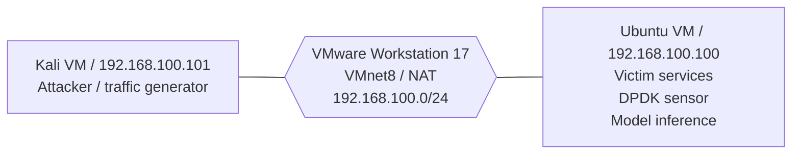

# T0.1 Lab topology

## Topology chính thức cho MVP ban đầu

| Node | Vai trò | Hệ điều hành | Inventory | VMnet/NIC |
|---|---|---|---|---|
| Kali VM | Attacker và traffic generator | Kali GNU/Linux Rolling 2026.2 | `observed` | `eth0`, `vmxnet3`, `192.168.100.101` |
| Ubuntu VM | Victim, sensor và model host | Ubuntu 24.04.4 LTS | `observed` | `ens33`, `e1000`, `192.168.100.100` |

VMware Workstation không cung cấp tên VMnet vào guest theo cách đáng tin cậy. Collector ghi nhận interface, địa chỉ, PCI address và driver nhìn thấy trong guest; người vận hành đã đối chiếu subnet `192.168.100.0/24` với `VMnet8` ở chế độ NAT trong Virtual Network Editor/VM Settings.

## Ranh giới nghiệm thu

Topology này đủ cho bước đầu kiểm tra traffic Kali gửi tới dịch vụ trên Ubuntu và xác nhận sensor/model cùng chạy trên Ubuntu. Nó không chứng minh sensor nhìn thấy unicast giữa hai endpoint khác, vì Ubuntu đồng thời là endpoint nhận traffic.

Khả năng passive/promiscuous vẫn phải qua gate T0.4. Nếu nghiên cứu yêu cầu quan sát traffic giữa attacker và một victim độc lập, lab phải bổ sung victim VM thứ ba hoặc cấu hình Ubuntu thành inline bridge hai data NIC; thay đổi đó không thuộc T0.1.

## Luồng quản trị

Management NIC riêng chưa được cấu hình. `eth0` trên Kali và `ens33` trên Ubuntu đều đang giữ default route qua `192.168.100.2`. Không bind các NIC này vào VFIO/UIO khi chúng vẫn là đường quản trị duy nhất. Việc bổ sung hoặc xác định management NIC riêng là điều kiện bắt buộc trước DPDK smoke test T0.3.

Ubuntu hiện dùng NIC ảo `e1000`, không phải `vmxnet3` như giả định smoke test ban đầu. Lựa chọn giữ `e1000` hay đổi virtual NIC sang `vmxnet3` phải được chốt ở T0.3 trước khi thay đổi cấu hình VM.
