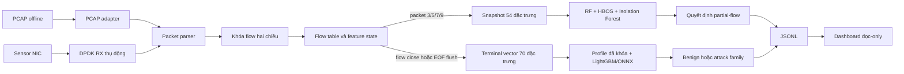

# Lý thuyết và cơ chế hoạt động của project NIDS

## 1. Phạm vi

Tài liệu này giải thích project theo góc nhìn hệ thống: gói tin đi vào từ đâu, được gom thành flow thế nào, đặc trưng được tạo lúc nào, mô hình ra quyết định ra sao và bằng chứng thực nghiệm được quản lý thế nào.

Nội dung được tổng hợp từ code, cấu hình, artifact hiện có và nhật ký phiên làm việc của workspace. Nhật ký chỉ được dùng để tìm quyết định thiết kế và cảnh báo vận hành; kết luận kỹ thuật được đối chiếu lại với file hiện có. Nhật ký cũ từng cảnh báo rằng trạng thái trong `docs/context.md` có lúc đi trước artifact trên ổ đĩa. Hiện tại `run_log/full-flow-v1/`, dataset, model bundle và log live đã tồn tại, nhưng trạng thái phase vẫn phải đọc theo evidence mới nhất.

Nguồn tổng quan: `docs/context.md`, `docs/plan-2.md`, `docs/final-report.vi.md`, `docs/general_architecture.puml`, `config/agent/current-task.json` và `run_log/`.

## 2. Bài toán và hai nhánh xử lý

Đây là một Network Intrusion Detection System (NIDS) thụ động. Hệ thống quan sát traffic TCP/UDP, xây dựng flow hai chiều, trích xuất đặc trưng thống kê và dùng mô hình học máy để phát hiện traffic đáng ngờ. Nó không nằm inline, không chuyển tiếp packet và không phải bridge.

Project có hai nhánh song song:

1. **Partial-flow:** phát hiện sớm khi flow đạt packet thứ 3, 5, 7 và 9, tương ứng F3/F5/F7/F9.
2. **Terminal-flow:** đợi flow đóng để khai thác toàn bộ vòng đời và phân loại multiclass.

Nhánh terminal không thay thế hoặc sửa schema/checkpoint đã nghiệm thu của nhánh partial. Ranh giới này được khóa trong `AGENTS.md`, `config/flow-feature-schema-v1.json`, `config/terminal-flow-feature-schema-v1.json` và `config/agent/current-task.json`.

## 3. Kiến trúc tổng thể

Hệ thống có ba mặt phẳng:

- **Data plane:** adapter, parser, flow table, feature engine, native inference và JSONL output.
- **Model-development plane:** dataset, hòa giải nhãn, split, training, threshold, ONNX và parity.
- **Control/evidence plane:** `tools/labctl.py`, script orchestration, contract, receipt, hash và dashboard.

Quan hệ build được định nghĩa trong `CMakeLists.txt`; sơ đồ khái niệm nằm ở `docs/general_architecture.puml`.

## 4. Topology lab và nguyên tắc passive

Lab dùng ba vai trò:

- **Kali:** tạo hoặc replay traffic.
- **Windows:** máy đích/victim.
- **Ubuntu:** sensor chạy DPDK và ONNX Runtime C++.

Ubuntu chỉ quan sát traffic trên NIC giám sát. DPDK bị khóa ở topology **một RX queue, 0 TX**. Sensor không NAT, không forward và không chặn packet. Cấu hình nằm ở `config/dpdk-passive.json`; adapter nằm ở `cpp/include/nids/dpdk_adapter.hpp` và `cpp/src/dpdk_adapter.cpp`.

PCAP adapter đọc record trực tiếp để export dataset hoặc replay offline, không đưa PCAP vòng qua DPDK. Hai adapter dùng chung lõi parser/flow/feature. Xem `cpp/src/pcap_adapter.cpp`, `docs/lab/topology.md` và `docs/lab/T8.5-runtime.vi.md`.

## 5. Từ packet đến flow

### 5.1 Parse và định danh flow

`cpp/src/packet.cpp` giải mã Ethernet/IPv4 và TCP hoặc UDP thành `PacketView`. `make_flow_key()` trong `cpp/include/nids/flow.hpp` chuẩn hóa hai endpoint `(IP, port)` thành cặp `low/high`; do đó A→B và B→A cùng thuộc một flow. Chiều packet được xác định là `forward` hoặc `reverse` dựa trên source của packet đầu tiên.

Cùng một 5-tuple có thể được tái sử dụng. Project dùng `generation` và `FlowInstanceId` để không trộn thống kê của hai kết nối khác nhau. SYN mới không phải retransmission có thể đóng generation cũ và mở generation mới.

### 5.2 Vòng đời flow

Flow có thể đóng bởi idle timeout, maximum age, TCP RST, hoàn thành FIN hai chiều, tuple reuse, capacity eviction hoặc end-of-input. `FlowTable` giữ state, watermark thời gian, packet count theo chiều, feature state và checkpoint tracker.

Contract trong `cpp/include/nids/flow.hpp` đặt idle timeout 60 giây, maximum age 30 phút, giới hạn 65.536 active flow và memory budget 256 MiB. Đây là cấu hình hợp đồng trong code, không phải số đo hiệu năng.

## 6. Nhánh partial-flow F3/F5/F7/F9

### 6.1 Checkpoint

F3 là snapshot sau khi packet thứ 3 đã được cập nhật vào state/feature; F5, F7 và F9 tương tự. Mỗi checkpoint phát đúng một lần cho mỗi generation. Hệ thống không tạo checkpoint giả nếu flow chưa đạt mốc. Contract nằm ở `cpp/include/nids/checkpoint.hpp`.

### 6.2 Vector 54 đặc trưng

`nids.flow_features.v1` là vector thứ tự cố định gồm 54 giá trị. Các nhóm chính gồm packet/byte theo chiều, độ dài packet, inter-arrival time, duration/rate, đổi chiều, cờ TCP, TCP window, TTL, payload/header statistics và tỷ lệ hai chiều.

Định nghĩa chuẩn nằm ở `config/flow-feature-schema-v1.json`; state và phép tính native nằm ở `cpp/include/nids/feature.hpp` và `cpp/src/feature.cpp`. Metadata như flow ID, timestamp, checkpoint và split group phục vụ audit nhưng không phải model input. Snapshot bị từ chối nếu metadata sai hoặc vector có NaN/Inf.

### 6.3 Mô hình và luật fusion

Nhánh partial dùng:

1. **Flow Random Forest:** supervised binary classifier cho known attack/benign.
2. **HBOS:** anomaly detector học profile benign.
3. **Isolation Forest:** anomaly detector benign-only thứ hai.
4. **Known-family RF:** gợi ý family và confidence khi nhánh supervised báo attack.

Nguồn offline nằm trong `python/nids_mvp/rf_baseline.py`, `anomaly_baseline.py`, `known_family_rf.py` và `threshold_calibration.py`; native inference nằm ở `cpp/src/model_runtime.cpp`.

`DecisionEngine::classify()` trong `cpp/src/alert.cpp` áp luật:

| Điều kiện | Quyết định | Cách hiểu |
|---|---|---|
| Flow RF vượt threshold | `known_attack` | Attack thuộc vùng supervised đã học |
| Flow RF không vượt; cả HBOS và Isolation Forest bất thường | `unknown_candidate` | Ứng viên bất thường ngoài quyết định supervised |
| Chỉ một anomaly model bất thường | `uncertain` | Chưa đủ đồng thuận |
| Không điều kiện nào đúng | `benign` | Không vượt gate tại checkpoint đó |

`unknown_candidate` không đồng nghĩa với định danh đúng loại tấn công. Family candidate chỉ là thông tin phụ và có thể sai. FTP-Patator từng sinh alert nhưng bị gán sai family; phải ghi đúng kết quả này. Xem `AGENTS.md` và `docs/lab/T8.5-live-attacks.vi.md`.

### 6.4 Incident lifecycle

Một flow có thể tạo tín hiệu ở nhiều checkpoint. `IncidentTracker` trong `cpp/src/detection_pipeline.cpp` liên kết alert cùng `FlowInstanceId`, yêu cầu checkpoint tăng đúng thứ tự và theo dõi first/latest checkpoint.

Luồng native là:

`CheckpointSnapshot → ModelBundle::infer() → DecisionEngine → IncidentTracker → JSONL`.

Bundle loader kiểm tra inventory, manifest, schema, hash và tensor metadata trước inference; xem `cpp/src/model_runtime.cpp`.

## 7. Nhánh terminal full-flow T9.1

### 7.1 Terminal record

Một số thông tin chỉ hoàn chỉnh khi flow kết thúc: close reason, tổng vòng đời, FIN/RST, protocol/port context và thống kê toàn flow. Nhánh terminal phát một record cho mỗi flow generation khi đóng hoặc EOF-flush. Nguồn: `cpp/include/nids/terminal_feature.hpp`, `cpp/src/terminal_feature.cpp`, `cpp/src/terminal_flow_export.cpp`.

### 7.2 Schema 70 và profile prefix

`nids.terminal_flow_features.v1` có 70 cột:

- 0–53: giữ nguyên 54 đặc trưng legacy;
- 54–69: append protocol, traffic/context, port và lifecycle terminal.

Schema có các profile prefix A–E. A dùng 54 feature đầu; E dùng đủ 70. Việc so sánh prefix cho biết nhóm terminal bổ sung có cải thiện validation hay không mà không phá nhánh cũ. Nguồn: `config/terminal-flow-feature-schema-v1.json`.

### 7.3 Schema 70 nhưng bundle V1 hiện dùng 54

Feature engine và dataset hỗ trợ 70 chiều, nhưng model V1 hiện được bundle cho native runtime đã chọn **profile A**, tức dùng 54 chiều đầu. Bằng chứng:

- `run_log/full-flow-v1/model/manifest.json`: `selected_profile = A`, `selected_feature_count = 54`;
- `cpp/include/nids/terminal_model_runtime.hpp`: `terminal_model_feature_count_v1 = 54`;
- `run_log/full-flow-v1/model/terminal-flow.bundle/preprocessing.json`.

Phát biểu chính xác là: **nhánh terminal tạo schema 70 chiều nhưng bundle production V1 hiện suy luận bằng prefix 54 chiều được chọn trên validation**.

### 7.4 Training và quyết định terminal V1

`python/nids_mvp/full_flow_dataset.py` tạo dataset Parquet từ terminal shard và kiểm tra schema/split/label/manifest. `python/nids_mvp/full_flow_model.py` huấn luyện LightGBM multiclass trên train, dùng validation để chọn threshold/profile và lưu artifact.

Class order hiện tại là:

`Benign, FTP-Bruteforce, SSH-Bruteforce, PortScan, DoS, Other`.

Runtime tính `attack_score = 1 - P(Benign)`. Nếu score vượt threshold, nó chọn attack class có xác suất cao nhất; nếu không thì quyết định Benign. Logic nằm ở `python/nids_mvp/full_flow_model.py`, `cpp/src/terminal_model_runtime.cpp` và `cpp/apps/nids_t91_terminal_live.cpp`.

### 7.5 Native runtime

Khi flow đóng, `TerminalFeatureEngine::close()` tạo vector; `TerminalModelBundle::infer()` chọn prefix đã khóa, cast finite float64→float32, chạy ONNX Runtime và kiểm tra output. `TerminalInferenceSink` chỉ ghi alert khi attack gate pass; diagnostic mode có thể ghi cả decision event.

Output chứa artifact identity, flow metadata, close reason, xác suất từng class, attack score, threshold và gated decision. Bundle được bảo vệ bằng expected manifest SHA-256, exact inventory, feature schema và tensor metadata.

### 7.6 Model V2

Workspace có thiết kế Model V2 binary-head + family-head và audit 70 cột tại `python/nids_mvp/full_flow_v2_model.py`, `config/terminal-flow-model-v2-audit-contract.json` và `run_log/full-flow-v1/model-v2/audit/`. Tuy nhiên `config/agent/current-task.json` vẫn khóa production fit, threshold selection, holdout access và sealed test; V2 bundle/native runtime chưa hoàn tất. Không được trộn trạng thái V2 với bundle V1 đang chạy.

## 8. Pipeline offline và chống leakage

Chuỗi mô hình hóa:

1. inventory PCAP/label;
2. parse và export flow;
3. reconcile label;
4. tạo snapshot/terminal dataset;
5. chia partition theo capture/time/group;
6. fit preprocessing/model trên train;
7. chọn profile/threshold trên validation;
8. khóa artifact và export ONNX;
9. kiểm tra Python/native parity;
10. chỉ mở test sau khi mọi lựa chọn đã khóa.

Test partition T9.1 vẫn `sealed`. Không được đọc feature/metric/path/hash của test trước gate. Model V2 còn có split-lock và claim ledger để ngăn attempt xuất hiện ở nhiều partition. Xem `python/nids_mvp/full_flow_split.py`, `full_flow_v2_split.py`, `config/terminal-flow-model-v2-live-split-policy.json` và `terminal-flow-model-v2-live-split-lock.json`.

## 9. Artifact bundle và parity

Python joblib không được mang thẳng vào C++ production. Project đóng gói ONNX cùng manifest, schema, preprocessing, threshold và SHA-256. Loader native kiểm tra bundle trước khi tạo ONNX session. Parity bảo đảm Python/C++ không lệch feature order, preprocessing, tensor hoặc decision.

Nguồn: `python/nids_mvp/artifact_bundle.py`, `model_parity.py`, `cpp/src/model_runtime.cpp`, `terminal_model_runtime.cpp` và `run_log/full-flow-v1/model/terminal-flow.bundle/`.

## 10. JSONL và dashboard

Runtime ghi JSON Lines để từng event độc lập, dễ tail và audit. Partial-flow dùng `run_log/t8.5/detection.jsonl`; terminal có `alerts.jsonl`/`sensor.jsonl` dưới `run_log/full-flow-v1/`.

`dashboard/server/app.py` là FastAPI read-only consumer: đọc current task/receipt/manifest, tail JSONL bằng byte offset, gọi `tools/labctl.py` qua whitelist và phục vụ React frontend trong `dashboard/web/`. Demo fallback được gắn `source_kind`; demo event không phải evidence runtime mới.

## 11. Lab control và evidence

`tools/labctl.py` chuẩn hóa ba role `kali`, `ubuntu`, `windows`, tìm VM, xác nhận identity rồi SSH non-interactive có timeout. `status` kiểm tra host song song; `exec` chạy command trên đúng role và trả JSON.

Campaign script tạo run contract, preflight/ready receipt, sender/sensor log, summary, rollback receipt và hash. Thứ tự evidence nằm trong `run_log/receipt-index.json`: current task/contract và final acceptance mạnh hơn report hoặc attempt cũ. Receipt index có phần stale, nên task mới phải kiểm tra path/hash thực tế.

## 12. Bản đồ source

| Khu vực | Vai trò |
|---|---|
| `cpp/include/nids/`, `cpp/src/` | Packet, flow, feature, DPDK, ONNX và alert |
| `cpp/apps/` | Exporter, replay, DPDK live, terminal live |
| `python/nids_mvp/` | Dataset, training, evaluation, bundle, parity |
| `scripts/` | Orchestration, replay, verifier, campaign |
| `config/` | Schema, contract, policy, toolchain, runtime |
| `run_log/` | Artifact, receipt và raw evidence |
| `tools/labctl.py` | Control plane ba VM |
| `dashboard/` | API đọc-only và UI React |
| `tests/`, `cpp/tests/` | Unit/contract/parity/acceptance tests |

## 13. Hai luồng xử lý đầy đủ

Partial-flow:

1. DPDK nhận packet hoặc PCAP adapter đọc record.
2. Parser tạo `PacketView`.
3. Flow key chuẩn hóa hai endpoint và tìm generation.
4. Flow table cập nhật timing/feature.
5. Khi đạt F3/F5/F7/F9, engine tạo snapshot 54 chiều.
6. Native runtime tạo RF/HBOS/Isolation Forest/family scores.
7. Decision engine fusion và IncidentTracker nối lifecycle.
8. Alert được ghi JSONL; dashboard chỉ đọc.

Terminal-flow:

1. Bốn bước đầu dùng chung lõi.
2. Flow tích lũy đến close reason hoặc EOF flush.
3. Terminal engine tạo vector 70 chiều.
4. Bundle V1 chọn prefix 54 chiều.
5. ONNX trả sáu xác suất.
6. Gate dùng `1 - P(Benign)` và chọn attack family nếu pass.
7. Alert terminal được ghi cùng artifact/flow/score evidence.

## 14. Invariants

- Không sửa F3/F5/F7/F9 hoặc thứ tự 54 feature legacy.
- Terminal feature chỉ append trong namespace riêng.
- DPDK luôn một RX queue, 0 TX.
- Metadata/label/partition không trở thành model input ngoài schema.
- Không fit bằng validation/test.
- Không mở sealed test trước khi profile, thuật toán, hyperparameter và threshold khóa.
- Không gọi `unknown_candidate` là nhận diện đúng family.
- Không xem dashboard demo là runtime evidence.
- Không tin claim hoàn tất nếu artifact/path/hash không tồn tại.

## 15. Giới hạn diễn giải

Kết quả được đo trong VMware, CICIDS2017 và traffic lab có kiểm soát. Chúng chứng minh vertical slice/tính tái lập trong lab, không tự động suy rộng thành production.

Partial-flow đổi lượng ngữ cảnh lấy cảnh báo sớm; terminal-flow có nhiều ngữ cảnh nhưng quyết định muộn. Family candidate có thể sai dù gate phát alert. Replay tốc độ cao có thể làm biến dạng timing nếu dùng sai mục đích. Model V2 và sealed test vẫn chịu gate, không được mô tả như production đã hoàn tất.

## 16. Thứ tự đọc tiếp

1. `docs/general_architecture.puml`.
2. Hai schema trong `config/`.
3. `cpp/include/nids/flow.hpp`, `checkpoint.hpp`, `feature.hpp`.
4. `cpp/src/alert.cpp`, `detection_pipeline.cpp`.
5. `cpp/apps/nids_t91_terminal_live.cpp`.
6. `python/nids_mvp/full_flow_model.py`.
7. `config/agent/current-task.json`.
8. `docs/lab/T8.5-runtime.vi.md` và `tools/labctl.py`.
9. `run_log/`, luôn kiểm tra path/hash trước khi kết luận.
